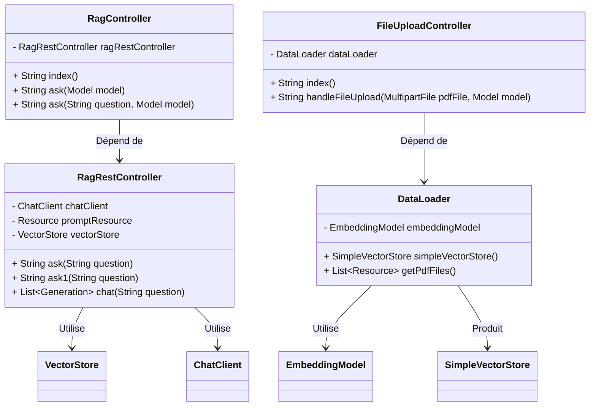

# Introduction

## Présentation générale du projet

Ce projet explore l'intégration de SpringIA avec un modèle de langage local, Ollama Mistal, en utilisant la technique de RAG (Retrieval-Augmented Generation). L'objectif est de démontrer comment enrichir les réponses d'un modèle de langage en utilisant des informations extraites de documents PDF.

## Définition des concepts clés

**SpringIA :** Framework utilisé pour développer des applications intelligentes et évolutives.  
**LLM (Large Language Model) :** Modèles de langage de grande taille capables de générer du texte de manière cohérente.  
**Ollama Mistal :** Un modèle de langage local performant utilisé dans ce POC.  
**RAG (Retrieval-Augmented Generation) :** Technique qui combine la récupération d'informations (retrieval) avec la génération de texte (generation) pour améliorer la pertinence et l'exactitude des réponses.

# Mise en place de l'environnement

## Inforamtion sur le projet

- Maven : 3.9.8
- Spring Boot : 3.2.8
- Java: 21
- Packaging : War

## Dépendance utiliser

- Spring Web
- Ollama AI
- spring-ai-pdf-document-reader
- thymeleaf

# Prérequie pour lancer le projet

Télécharger le modèle Ollama Mistal : https://ollama.com/download
Ouvrer un cmd et télécharger mistral : `ollama run mistral`

# Comment lancer le projet en ligne de commande
Sous windows, ouvrer un cmd : `mvn spring-boot:run`
> PS : assurez vous que mistral est lancer avant

# Diagramme des relations entre les classes



# Démonstration

## Cas d'utilisation

Recherche d'informations spécifiques dans les PDF.  
Génération de résumés et d'analyses basées sur les documents.

## Scénarios de test

Pour les tests, un faux CV en format PDF a été créé.
> src/main/resources/pdf/Fake-CV.pdf

Les tests ont été conduits en utilisant l'interface graphique ainsi que des appels API pour vérifier l'extraction et la génération des réponses.

## Exemples de requêtes et réponses

### Utilisation de l'interface graphique

**Lien de test :** http://localhost:8080/  
Via cette interface, les utilisateurs peuvent poser des questions et obtenir des réponses sur les données du PDF.

### Utilisation des données du PDF avec des appels API

**Lien de test :** [http://localhost:8080/ask?question=donne moi le titre dans le document](http://localhost:8080/ask?question=donne%20moi%20le%20titre%20dans%20le%20document)  
**Requête :** "Donne-moi le titre dans le document"  
**Réponse attendue :** CV of Jean dupon  
**Réponse obtenue :** The title in the provided content is not explicitly stated. However, based on the context, it appears to be a professional profile or resume of an individual named Jean Dupon, who is a Consultant Informatique with 3 years of experience in Java development.

### Utilisation du contexte tiré d'un texte avec des appels API
**text :**
 ``` text
Alex is a programmer working for hhachich Programming.
Alex is under paid.
Bob is a programmer working for Acme Programming.
Bob is paid more than Alex.
hhachich Programming is a consulting company that employs programmers.
```
**Lien de test :** [http://localhost:8080/ask1?question=who is alex](http://localhost:8080/ask1?question=who%20is%20alex)  
**Requête :** "Who is Alex?"  
**Réponse attendue :** Alex is a programmer who works for hhachich Programming.  
**Réponse obtenue :** Alex is a programmer who works for hhachich Programming.

# Project


